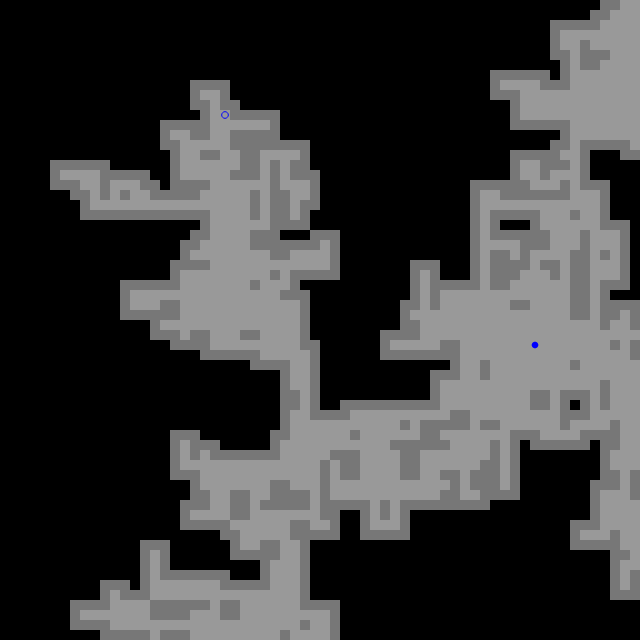

# Procedural Maze

This is a simple demo of a [random walk](https://en.wikipedia.org/wiki/Random_walk) generated maze.
Your goal is to move the player (filled blue circle) to the exit (stroked blue circle).

# Links

- [Canvas Terrain Generator](http://loktar00.github.io/Javascript-Canvas-Terrain-Generator/)
- [Create a Procedurally Generated Dungeon Cave System](https://gamedevelopment.tutsplus.com/tutorials/create-a-procedurally-generated-dungeon-cave-system--gamedev-10099)
- [Procedural Level Generation in Games](https://www.raywenderlich.com/49502/procedural-level-generation-in-games-tutorial-part-1)
- [Strand Topographic Map Tutorial](https://drive.google.com/file/d/1p6YginajOdPb4oLg1PhkBAPAY8Ns21nF/view)
- [Instant Planet Generator](http://eldritch.org/erskin/roleplaying/planet.php)
- [Polygon map generator](https://www.redblobgames.com/maps/mapgen2/)
- [Azgaar's Fantasy Map Generator](https://azgaar.github.io/Fantasy-Map-Generator/)

- [Procedural Generation in Game Design](https://www.crcpress.com/Procedural-Generation-in-Game-Design/Short-Adams/p/book/9781498799195)
